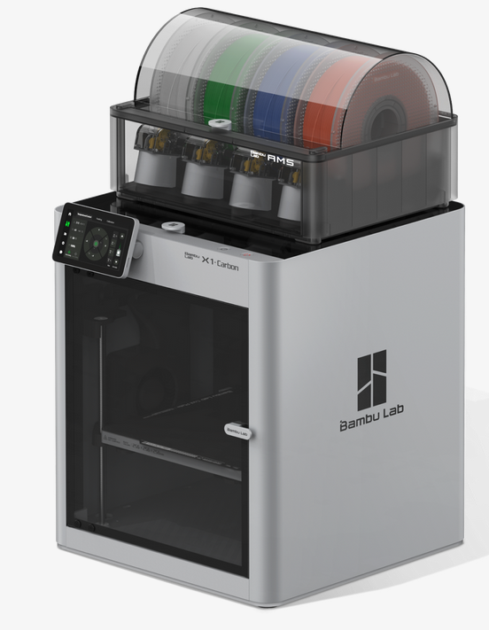

# intro_to_3D_printing
This repository is created and maintained by Ayyappadas Rajagopal

## 1. Introduction to 3D Printing

3D printing, also known as additive manufacturing, is a revolutionary technology that creates three-dimensional objects by adding material layer by layer based on a digital design. Unlike traditional manufacturing methods that often involve cutting away material (subtractive manufacturing), 3D printing builds objects from the ground up, enabling the creation of complex and customized structures with minimal waste.
### Key Concepts

#### Digital Model:
    The process starts with a 3D digital model, usually created using CAD (Computer-Aided Design) software or obtained from 3D scanning.

#### Slicing:
    The digital model is then sliced into thin horizontal layers using slicing software. Each slice represents a single layer of the final object.

#### Printing:
    The 3D printer deposits material (commonly plastic, resin, metal, or composite) layer by layer, following the slice data until the full object is formed.

#### Post-Processing:
    After printing, the object may require cleaning, curing (for resin prints), or support removal to achieve the desired finish and strength.

### Types of 3D Printing Technologies

#### FDM (Fused Deposition Modeling):
    Melts and extrudes thermoplastic filament layer by layer. It's the most common and affordable type for hobbyists.

#### SLA (Stereolithography):
    Uses a UV laser to cure liquid resin into hardened plastic, offering high precision and smooth finishes.

#### SLS (Selective Laser Sintering):
    Uses a laser to fuse powdered materials, typically nylon or metals, making it suitable for strong, functional parts.

### Applications
- Prototyping: Rapid development of product prototypes for testing and design iteration.
- Medical: Custom prosthetics, implants, and even bioprinting tissues.
- Aerospace & Automotive: Lightweight components and parts with complex geometries.
- Education: Hands-on learning in engineering, architecture, and design.

### Advantages
- Customization and complexity without additional cost.
- Reduced material waste.
- Faster prototyping cycles.
- On-demand production and reduced inventory needs.

### Limitations
- Slower for large-scale production.
- Material and structural limitations depending on the method.
- Surface finish and strength may require post-processing.

3D printing continues to evolve, pushing the boundaries of design and manufacturing across industries. Its versatility and accessibility are transforming how products are conceived, developed, and produced.

## 3D Printers (Example)

### 1. Bambu labs
- 3D printer manufcturer
- Bambu studio as 3D printing slicing software
- Webiste : https://bambulab.com/en-in/download/studio

#### Softwares

### From bambu labs

1. Bambu Handy - Android
- Bambu Handy app is a one-stop 3D printing service platform designed to offer a convenient, seamless, and enjoyable 3D printing experience. With Bambu Handy, you can control printers anywhere, connect to the MakerWorld models library, and print your favorite designs easily!
2. Bambu Suite - PC
- Bambu Suite is an intuitive and powerful software that supports laser cutting, blade cutting, pen drawing and so much more. From design and layout to final production, the entire process is seamlessly integrated into a single workflow. Its user-friendly interface and smart guidance make operation easy, while computer-vision-based alignment ensures precision and efficiency at every step, what-you-see-is-what-you-get.

3. Bambu Studio - PC
- Bambu Studio is an open-source, cutting-edge, feature-rich slicing software. It contains project-based workflows, systematically optimized slicing algorithms, and an easy-to-use graphical interface, bringing users an incredibly smooth printing experience.

## From ultimaker
1. Ultimaker cura
[cura-website](https://ultimaker.com/software/ultimaker-cura/)

### Customize 3D models:Makers world - 
- [web 1](https://makerworld.com/en/models/1055250-screw-generator-parametric-screws-nuts-washer#profileId-1042636)
- [web 2](https://makerworld.com/en/makerlab/parametricModelMaker?designId=1055250&from=model_page&modelName=Screw+Generator.scad&scadUrl=https%3A%2F%2Fmakerworld.bblmw.com%2Fmakerworld%2Fmodel%2FUS4c3761813497f0%2Fmsfile%2F2025-02-15_caf8c26e678e4.scad%3Fat%3D1748407675%26exp%3D1748407975%26key%3D8bf28773cb168db76fbb3280b6ccfba4%26uid%3D740845135&unikey=fd7fa4bc-e4cd-4d3b-8854-33fb6d9384a4)

- Note: every model configurable or not needs to be checked.

